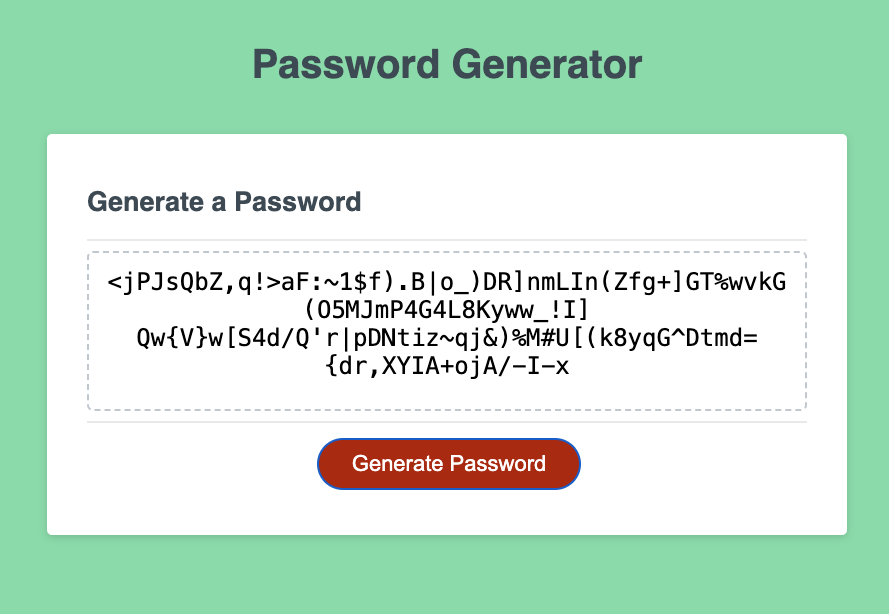

# JavaScript Password Generator

For: Coding Bootcamp @ UT Austin
By: Ryan Hanzel

## Description

Password generator made with JavaScript. The generator allows the user to generate an 8 through 128 character password with the choice of lowercase, uppercase, numeric, and special characters.

URL: [h3x.cafe/js-password-generator](https://h3x.cafe/js-password-generator)

GitHub: [github.com/h3xivall/js-password-generator](https://github.com/h3xivall/js-password-generator)
## Screenshot

